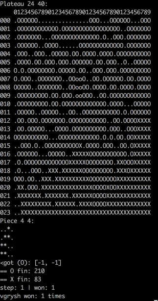
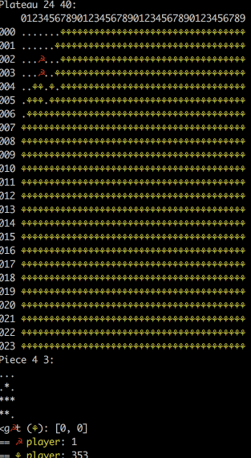

# Filler Project

## Project Overview  
Filler is 42 projects to learn about AI. The goal is that the last player put a piece that can have any size and shape sent by the virtual machine. 
To place a piece, he needs to cross the player's ONE cell and only ONE, and not overlap any of the competing cells. 

## Strategy  
The strategy is to check the relative position in comparison with the applicant.  
Then close enough from the opponent, surrounding it, keeping a sufficient distance. 

### How run:
 * ./resources/filler_vm -f ./resources/maps/map01  -p1 ./vgryshch.filler -p2 ./resources/players/carli.filler

### Add animation
 * ./resources/filler_vm -f ./resources/maps/map01  -p1 ./vgryshch.filler -p2 ./resources/players/carli.filler | ./bonus/visualization.c

### Filler

### With simple visualisations

